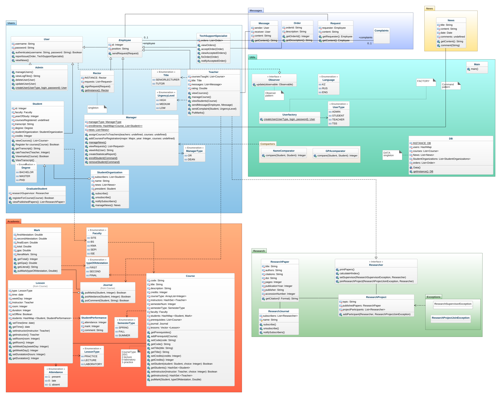

# OOP Final Project

## About Project
Project - university system **INTRANET**. We have classes (superclasses, subclasses), interfaces, serialization, exceptions, patterns(decorator, singleton, factory, observer), etc. - all techniques we have studied.
Before coding we designed our system - create an architecture using UML diagrams (Use case, Class Diagrams).
## Report
Also, you can find [Presentation](Final_PPT.pdf) and [Report](Report%20OOP%20(1).pdf) about project.
## Team Members
|    Surname     |   Name   |                     Github                     |
|:--------------:|:--------:|:----------------------------------------------:|
|    Yergali     | Bereket  |   [Click Here](https://github.com/beereket)    |
|  Zhumabayev    |  Askar   |   [Click Here](https://github.com/w0nsdoof)    |
|   Tuzelbayev   | Daniyal  |  [Click Here](https://github.com/holydanchik)  |
| Khassangaliyev | Islam    |    [Click Here](https://github.com/Otakanutyy) |

